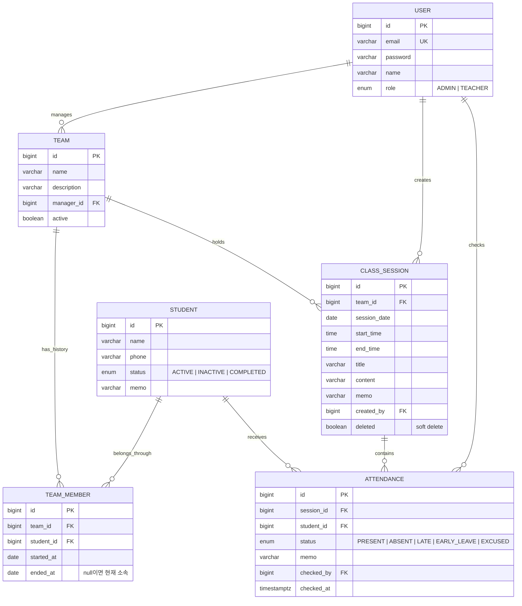

# 로이엣 교육센터 관리

기독교 성경 교육센터의 팀, 학생, 수업, 출석 기록을 관리하는 내부 운영 서비스입니다. 과목이나 커리큘럼 엔티티 없이 **팀이 특정 날짜에 진행한 수업(ClassSession)** 과 당시 팀원의 **학생별 출석(Attendance)** 을 기록합니다.

스마트폰 사용을 우선해 설계했습니다. 모바일에서는 하단 내비게이션과 카드/목록 UI를 사용하며, 출석 화면에서 수업 정보와 전체 학생의 출석을 한 번에 저장할 수 있습니다. 태블릿과 데스크톱에서는 정보 밀도와 탐색 구조가 자연스럽게 확장됩니다.

## 기술 스택

| 영역 | 기술 |
| --- | --- |
| Frontend | Next.js 16.3.4, React 19, TypeScript, Tailwind CSS 4, shadcn/ui 구조, TanStack Query, React Hook Form, Zod |
| Backend | Java 21 target, Spring Boot 4.1.1, Spring Data JPA, Spring Security, JWT, Gradle Kotlin DSL |
| Database | PostgreSQL 17, Flyway |
| Test | JUnit 5, Spring Boot Test, H2, Playwright (Chrome/WebKit) |

## 프로젝트 구조

```text
roiet/
├── frontend/                    # Next.js App Router 프로젝트
│   ├── src/app/                 # 페이지, 레이아웃, PWA manifest
│   ├── src/components/          # 디자인 시스템과 도메인 컴포넌트
│   ├── src/lib/                 # API client, 타입, 공통 함수
│   └── tests/                   # 반응형 및 실제 API E2E 테스트
├── backend/                     # Spring Boot REST API
│   └── src/main/java/com/roiet/center/
│       ├── controller/          # REST endpoint
│       ├── service/             # 트랜잭션과 비즈니스 규칙
│       ├── repository/          # JPA 조회
│       ├── domain/              # JPA entity
│       ├── dto/                 # API request/response
│       ├── security/            # JWT 발급/검증
│       ├── exception/           # 공통 예외 응답
│       └── config/              # 보안과 설정
└── compose.yaml                 # 개발용 PostgreSQL
```

## ERD



`attendances(session_id, student_id)`에는 unique constraint가 있습니다. PostgreSQL에서는 `team_members(student_id) WHERE ended_at IS NULL` partial unique index로 학생당 현재 소속을 한 건으로 제한합니다.

## 로컬 실행

필요한 프로그램은 Docker, JDK 21 이상, Node.js 20 이상입니다. Gradle은 Wrapper가 포함되어 있어 별도 설치가 필요하지 않습니다.

```bash
# 1. PostgreSQL 시작
docker compose up -d postgres

# 2. Backend 시작 (새 터미널)
cd backend
./gradlew bootRun

# 3. Frontend 시작 (새 터미널)
cd frontend
npm install
npm run dev
```

브라우저에서 `http://localhost:3000`을 엽니다. Flyway가 최초 실행 시 스키마와 테스트 데이터를 생성합니다.

개발 로그인 계정:

- 관리자: `admin@example.com` / `admin1234`
- 교사: `teacher@example.com` / `teacher1234`

## 환경 변수

Backend:

| 변수 | 기본값 | 설명 |
| --- | --- | --- |
| `DB_URL` | `jdbc:postgresql://localhost:5432/roiet` | PostgreSQL JDBC URL |
| `DB_USERNAME` | `roiet` | DB 사용자 |
| `DB_PASSWORD` | `roiet` | DB 비밀번호 |
| `JWT_SECRET` | 개발용 기본 문자열 | JWT 서명 키. 운영에서는 32바이트 이상의 임의 값 필수 |
| `JWT_EXPIRATION_MINUTES` | `480` | JWT 유효 시간(분) |
| `FRONTEND_URL` | `http://localhost:3000` | CORS 허용 origin |
| `SERVER_PORT` | `8080` | API 포트 |

Frontend:

| 변수 | 기본값 | 설명 |
| --- | --- | --- |
| `API_URL` | `http://localhost:8080` | Next.js rewrite가 연결할 Backend 주소 |

## API 구조

JWT가 필요한 요청은 `Authorization: Bearer <token>` 헤더를 사용합니다. Entity는 직접 반환하지 않고 요청/응답 DTO를 사용합니다.

| Method | Endpoint | 용도 |
| --- | --- | --- |
| POST | `/api/auth/login` | 로그인과 JWT 발급 |
| GET | `/api/users/teachers` | 팀 담당자로 지정 가능한 교사 목록 |
| GET / POST | `/api/teams` | 팀 목록 / 생성 |
| GET / PATCH | `/api/teams/{id}` | 팀 상세 / 수정 |
| GET | `/api/teams/{id}/students?date=YYYY-MM-DD` | 해당 날짜의 유효 팀원 명단 |
| GET | `/api/teams/{id}/attendance-statistics` | 팀 출석 통계 |
| GET / POST | `/api/students` | 검색·필터 목록 / 생성 |
| GET / PATCH | `/api/students/{id}` | 학생 상세 / 수정 |
| POST | `/api/students/{id}/move-team` | 팀 이동 |
| GET / POST | `/api/sessions` | 수업 목록 / 수업+출석 일괄 생성 |
| GET / PATCH | `/api/sessions/{id}` | 수업 상세 / 수업 정보 수정 |
| PUT | `/api/sessions/{id}/attendance` | 출석 전체 수정 |
| DELETE | `/api/sessions/{id}` | ADMIN 전용 수업 soft delete |
| GET | `/api/dashboard` | 오늘 수업, 주간 통계, 확인 필요 학생 |

## 주요 비즈니스 규칙

- 학생의 팀은 `Student.teamId`가 아닌 `TeamMember` 기간 이력으로 관리합니다.
- 현재 소속은 `endedAt == null`인 이력입니다. 팀 이동 시 기존 이력은 이동 전날 종료되고 새 이력이 시작됩니다.
- 수업 생성 시 수업 날짜에 유효한 팀원 전체와 출석 입력의 학생 집합이 정확히 일치해야 합니다.
- 수업과 출석은 하나의 트랜잭션으로 저장됩니다. 하나라도 실패하면 전부 rollback됩니다.
- 수업 날짜 변경으로 팀원 구성이 달라지면 기존 출석 기록 보호를 위해 변경을 거부합니다.
- 출석 중복은 서비스 검증과 DB unique constraint 양쪽에서 막습니다.
- 수업 삭제는 출석 이력을 보존하기 위해 hard delete 대신 `deleted=true`로 처리합니다.
- 출석률 정책은 `AttendancePolicy`로 분리되어 있습니다. 지각과 조퇴를 출석으로 인정할지는 설정으로 변경할 수 있습니다.
- 확인 필요 학생 기준은 `app.alerts` 설정으로 관리하고 조회 시 계산합니다.
- `ADMIN`은 팀·학생 정보와 팀 이동을 관리하고, `TEACHER`는 조회 및 수업·출석 기록을 담당합니다.

## 모바일 UX

- 360–430px: 하단 고정 내비게이션, 단일 열 목록, 44px 이상 터치 타깃
- 출석: 전체 출석, 개별 상태 즉시 변경, 이름 검색, 선택 상태의 색상+체크+텍스트 표시
- 저장: 내비게이션 위 고정 Action Bar와 iPhone safe area 처리
- 키보드: `visualViewport`를 사용해 키보드가 열린 동안 Action Bar 위치 조정
- 장애 복구: 저장 실패 시 입력 유지, 수업 작성 중 session storage 임시 보관
- PWA: manifest, standalone 표시, 앱 아이콘과 `viewport-fit=cover` 적용
- Desktop: 고정 Sidebar, 학생 표, 넓은 그리드로 presentation 전환

## 테스트

```bash
# Backend 단위/서비스/API 통합 테스트
cd backend
./gradlew test

# Frontend production build + TypeScript
cd frontend
npm run build

# Chrome 360/390/430, Tablet, Desktop 및 WebKit 390 반응형 E2E
npm run test:e2e -- tests/mobile.spec.ts

# 실행 중인 실제 Backend/PostgreSQL과 연결한 모바일 전체 흐름
LIVE_API=1 npm run test:e2e -- tests/live.spec.ts --project=mobile-390
```

실제 API E2E는 고유한 `QA팀`과 `QA학생` 테스트 데이터를 생성합니다.
